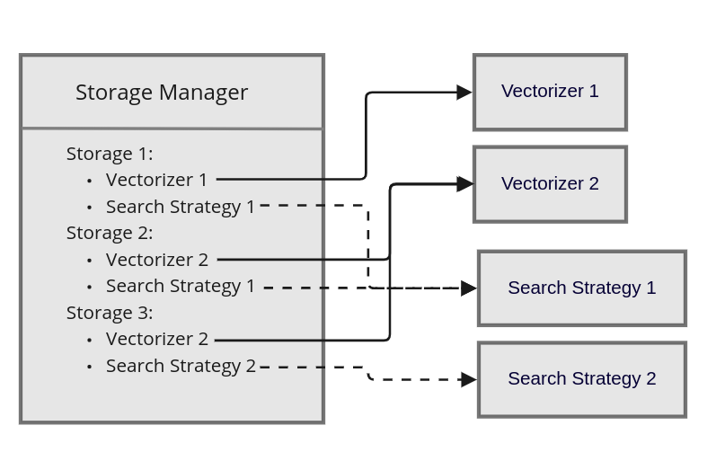
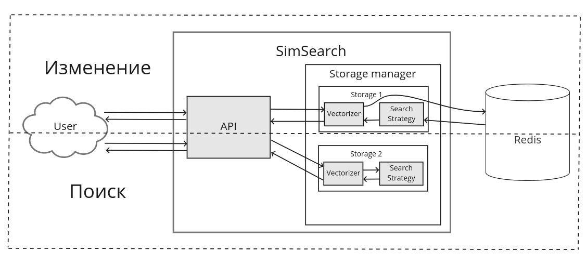
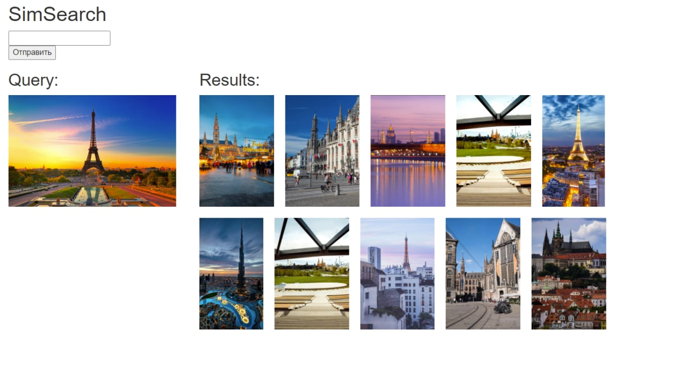
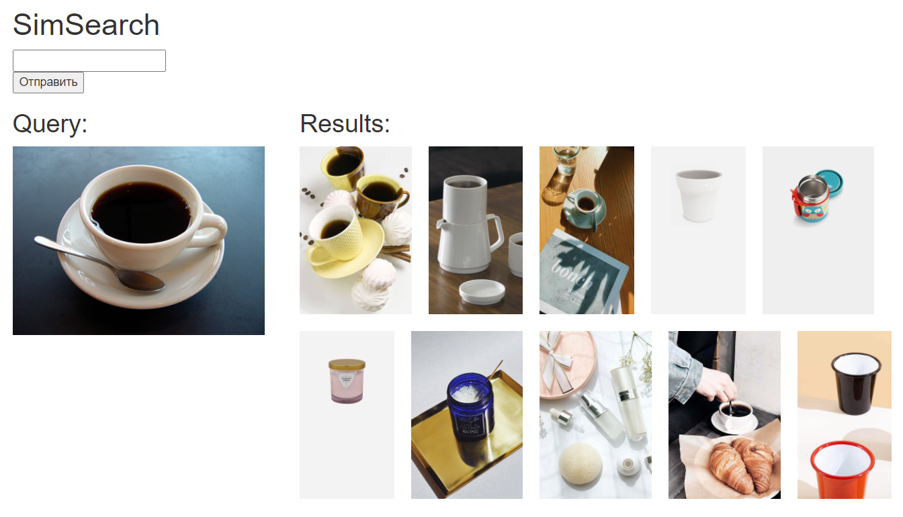
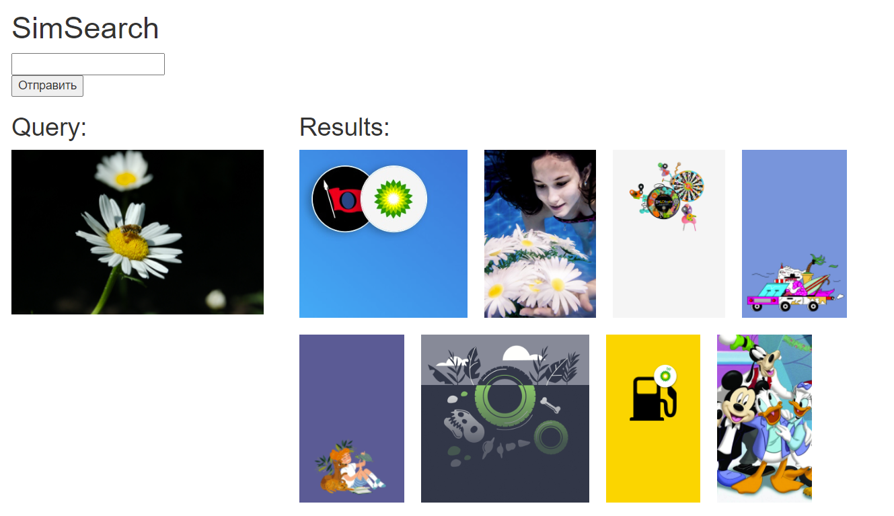

# Курсовая работа "Сервис поиска соседних объектов"

<u>Выполнил Константин Амеличев под руководством Андрея Тощева, Tinkoff.ru</u>

## Annotation (rus/eng)

В рамках курсовой работы описывается исследование задачи поиска ближайших соседей и разработка поискового сервиса SimSearch. SimSearch позволяет находить объекты, максимально похожие по свойствам на запрошенный пользователем объект. Описывается возможность реализовать поисковое приложение для любого типа объектов, у которых определена функция перевода их характеристик в вектор: для изображений, документов, пользователей рекомендательной системы и прочего. Данный подход демонстрируется разработанным поиском похожих изображений на основе SimSearch.

**Ключевые слова:** Задача поиска ближайшего соседа, поисковые системы.

The course work describes the study of the problem of finding nearest neighbors and the development of the search service SimSearch. SimSearch allows you to find objects that are most similar in properties to the object requested by the user. The possibility is described to implement a search application for any type of objects that have a function for translating their characteristics into a vector: for images, documents, users of a recommender system, and others. This approach is demonstrated by the developed search for similar images based on SimSearch.

**Keywords:** Nearest neighbor search, search engine.

## Картиночки

